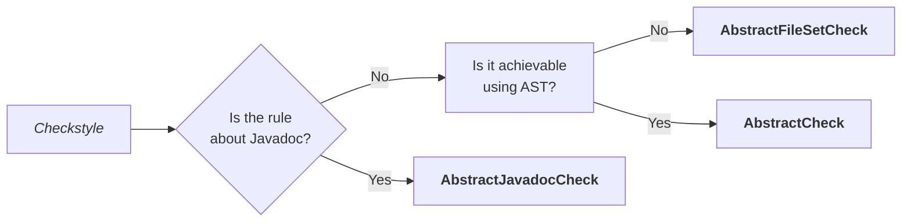
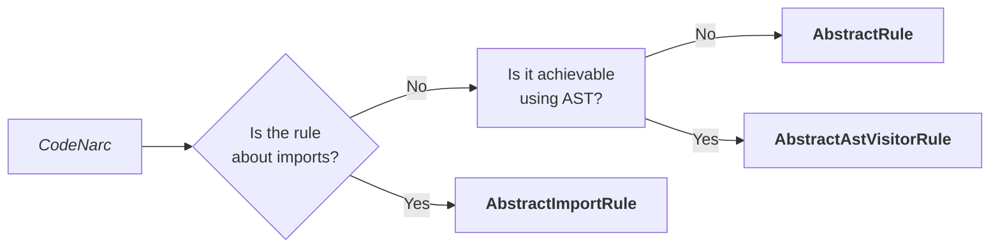
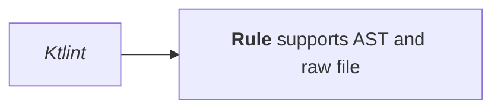
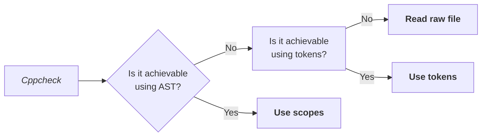
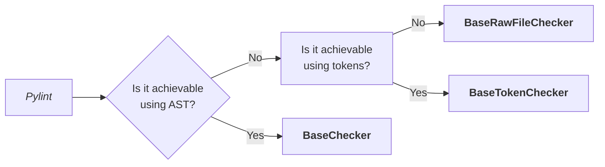
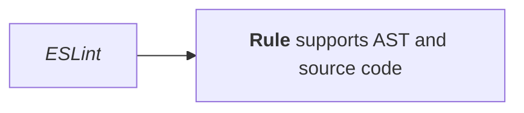

# Developing

Custom rules for each linter are implemented differently based on the tool capabilities and the limitations of the underlying language parser. Below are the details on which classes to extend for each linter.













## Configuration file

Rule message templates are stored in configuration files, distinct for each
source language.

Source language | Target language | File extension
--- | --- | ---
Kotlin | Java, Groovy, Kotlin | `.properties`
Python | C/C++, Python | `.cnf`
TypeScript | JavaScript, TypeScript | `.json`

## Debugging

Printing the AST tree to the console is possible with Checkstyle and Ktlint.

### "Ktlint"

> This command is no longer available in newer versions of Ktlint, use version
  [0.47.0](https://github.com/pinterest/ktlint/releases/tag/0.47.0).

```shell
ktlint --color printAST $file
```

### Checkstyle

```shell
checkstyle -T $file
checkstyle -J $file # for javadoc
```
