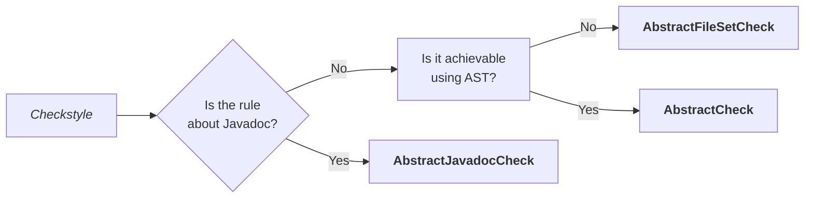
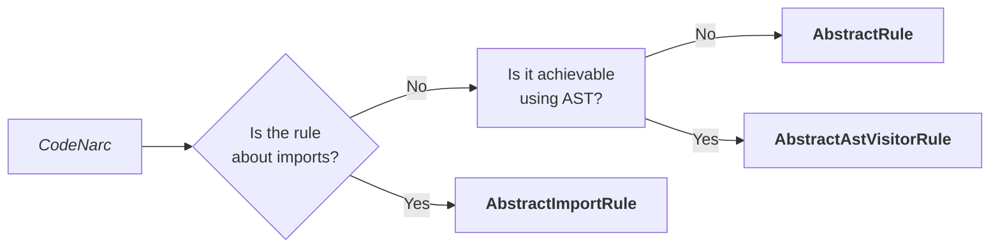
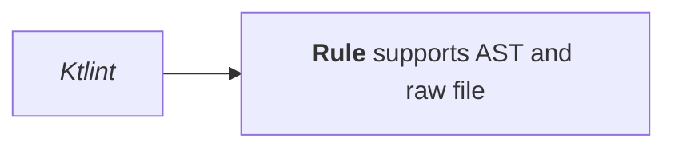
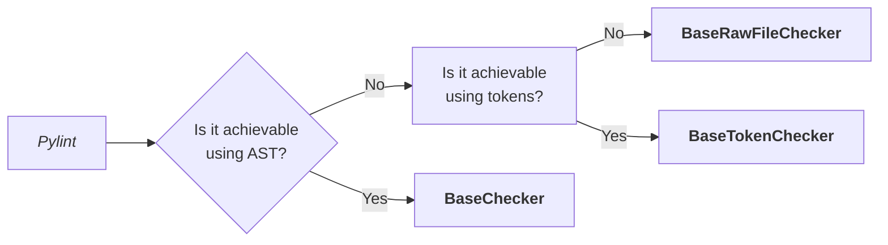

Custom rules for each linter are implemented differently based on the tool capabilities and the limitations of the underlying language parser. Below are the details on which classes to extend for each linter.

## Rule naming

Rule names are in form of state (missing-braces) or object (package-name). They are grouped by the intended objective (spacing) rather than the target site (imports). The rule messages that are printed to the console are in the form of verb phrase (Add missing braces or Rename package).

When possible, merge rules of relatable targets that achieve the same goal. For example, missing-if-braces and missing-for-braces can be merged into control-flow-bracing. Ignore this guideline if one of the rules is not applicable by the linter tool or in the language.
